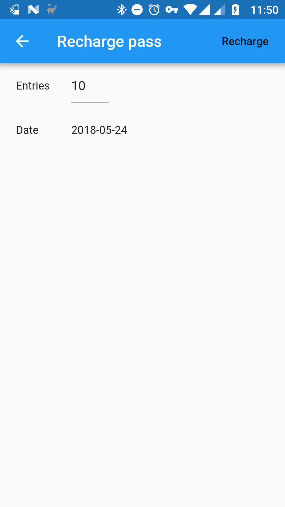
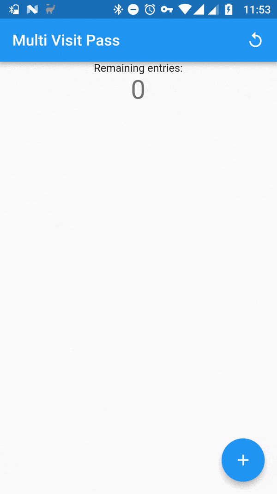
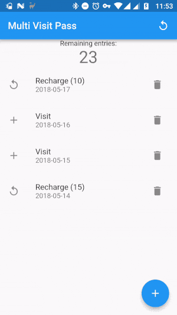
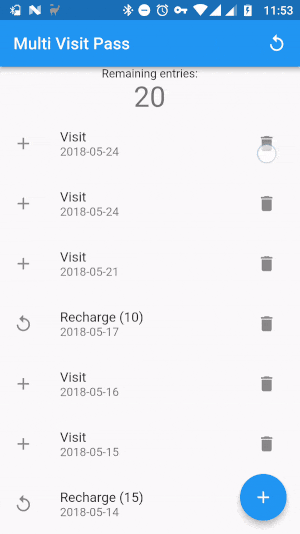

# Multi Visit Pass

The Multi Visit Pass app is a wallet to keep track of the number of entries bought for a pay per visit place. With it you can log every visit to the gym, swimming pool, or other place and it tells you the number of entries remaining.

App shows the number of remaining entries and the history of recharges and visits:

Press the recharge button on the top right to recharge your pass with some entries:

Press the plus button in the bottom right to log a visit:

If there are no remaining entries you cannot log a visit:

To delete a visit or a rechage press the trash button in the right of the entry to remove:

